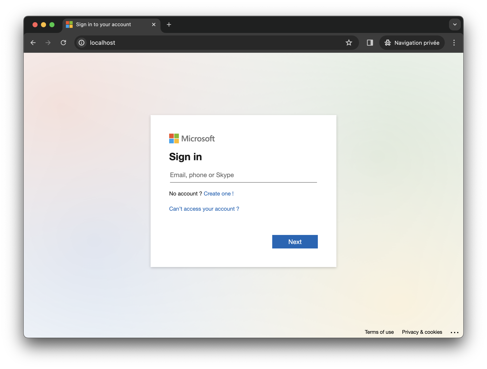
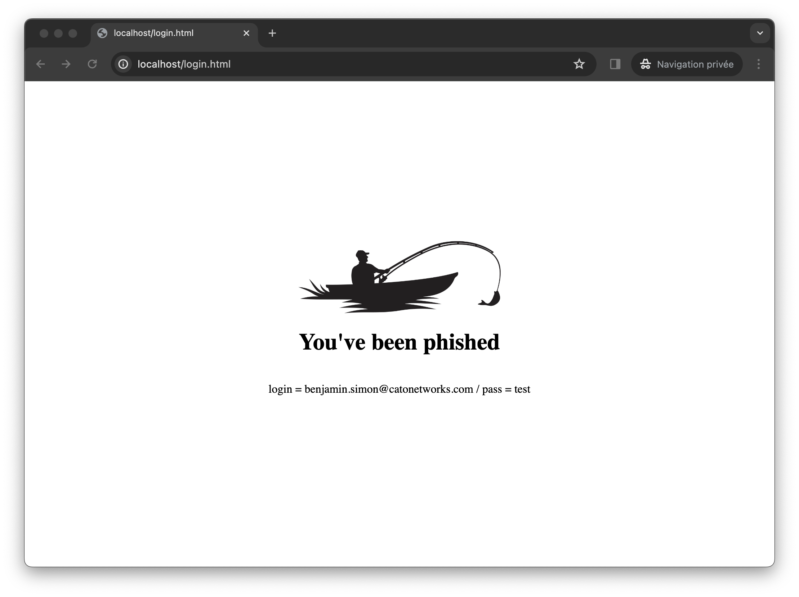

<h3 align="center">Demo Phishing</h3>

## About Project

Web application to simulate O365 phishing site using Python Flask.






## Getting Started with Docker

#### Container deployment 

```
docker run -d -p 80:80 benkpy/phishing:v1
```

#### Test

You can test access to the application by using http://127.0.0.1

